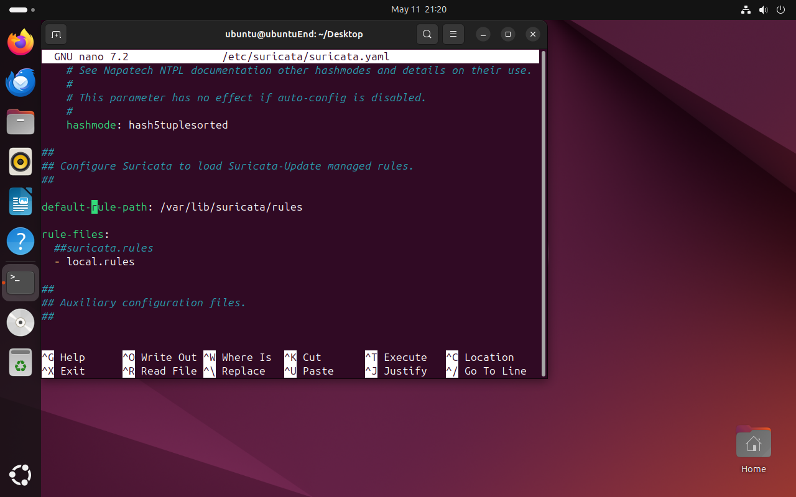
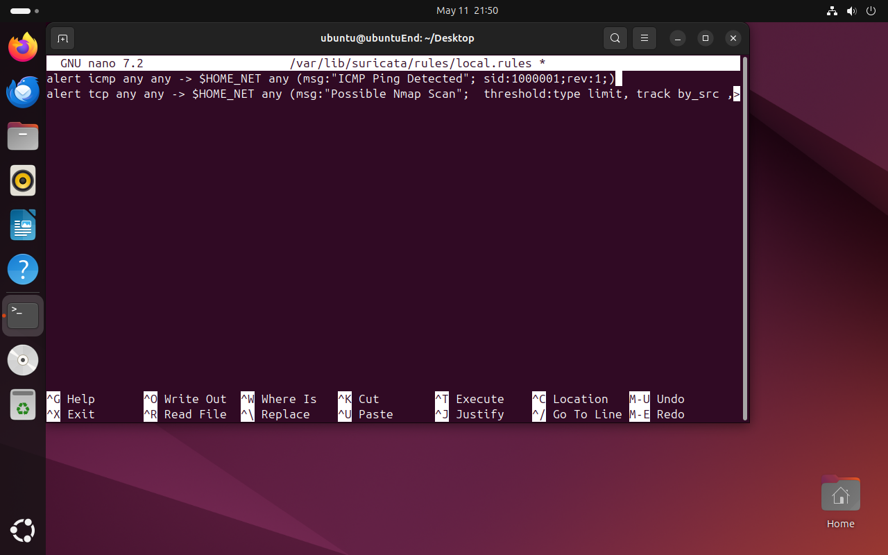
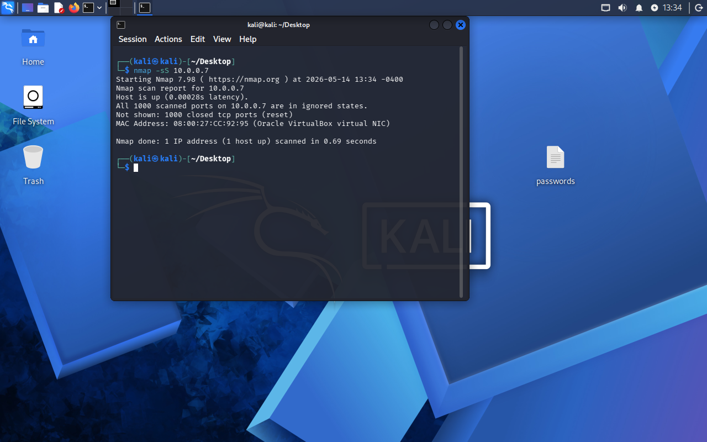
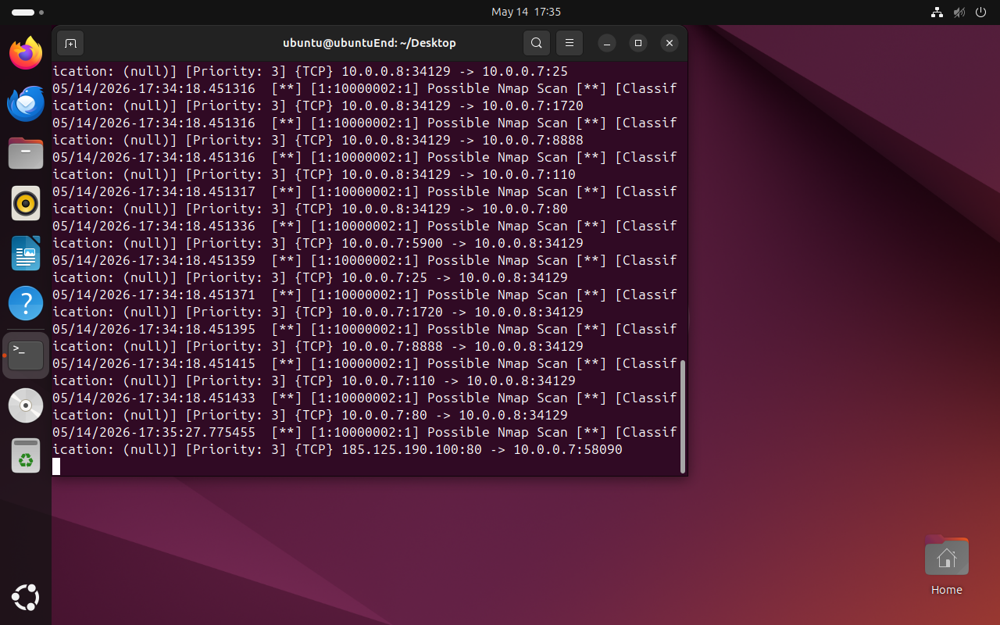

# Suricata IDS/IPS Homelab Project

## Overview

This project demonstrates the deployment and configuration of a Suricata Intrusion Detection and Prevention System (IDS/IPS) in a virtualized lab environment. The goal of the project is to monitor network traffic, detect suspicious activity, and generate alerts for malicious behavior such as port scanning, brute-force attempts, and malware-related traffic.

---

# Objectives

* Deploy Suricata on Ubuntu Server
* Configure IDS
* Monitor live network traffic
* Create custom detection rules
* Simulate attacks from Kali Linux
* Analyze Suricata alerts and logs
* Gain hands-on experience with network security monitoring

---

# Lab Environment

| System        | Role             | IP Address    |
| ------------- | ---------------- | ------------- |
| Ubuntu Server | Suricata IDS/IPS | 10.0.0.7 |
| Kali Linux    | Attacker Machine | 10.0.0.8 |
Network Type: Host-Only Adapter

---

# Tools and Technologies

* Suricata
* Ubuntu Server
* Kali Linux
* VirtualBox
* Nmap
* Linux CLI

---

# Hardware Requirements

| Component      | Minimum Requirement   |
| -------------- | --------------------- |
| CPU            | Dual-Core Processor   |
| RAM            | 8 GB                  |
| Storage        | 80 GB Available Space |
| Virtualization | Enabled in BIOS       |

---

# Installing Suricata
## Update Ubuntu

```bash
sudo apt update && sudo apt upgrade -y
```

## Install Suricata

```bash
sudo apt install suricata -y
```

## Verify Installation

```bash
suricata --build-info
```

---

# Network Interface Configuration

Identify the network adapter and interface name:

```bash
ip a
```

Edit Suricata configuration:

```bash
sudo nano /etc/suricata/suricata.yaml
```

Find :
```yaml
 address-groups:
  $HOME_NET: "[specify the address group you want to monitor]"
```
In my case it is 10.0.0.0/24.

Find:

```yaml
af-packet:
  - interface: eth0
```

Replace `eth0` with your actual interface name if different.

---

# Starting Suricata

```bash
sudo systemctl enable suricata
sudo systemctl start suricata
```

Check service status:

```bash
sudo systemctl status suricata
```

---

# Testing Suricata
View alerts:

```bash
sudo tail -f /var/log/suricata/fast.log
```

---

# Custom Rules

Custom rules are stored in:

```bash
/etc/suricata/rules/local.rules
```
But before we have to create the rules-file 
```bash
rule-files:
  -local.rules
```

rule-files is a list that tells Suricata which rule files to load and activate when it starts up.

Now let's edit the configuration files local.rules

```bash
 sudo nano /var/lib/suricata/rules/local.rules
```

## ICMP Ping Detection

```bash
alert icmp any any -> $HOME_NET any (msg:"ICMP Ping Detected"; sid:1000001; rev:1;)
```

## Nmap Scan Detection

```bash
alert tcp any any -> $HOME_NET any (msg:"Possible Nmap Scan"; flags:S; threshold:type threshold, track by_src, count 20, seconds 10; sid:1000002; rev:1;)
```

Test the configuration file:
```bash
sudo suricata -T -c /etc/suricata/suricata.yaml -v
```
Restart Suricata after adding rules:

```bash
sudo systemctl restart suricata
```

---

# Attack Simulation

## Nmap Scan

Run from Kali:

```bash
nmap -sS 10.0.0.7
```


Expected Result:

* Suricata generates scan alerts in `fast.log`

---

# Log Analysis

## Fast Log

```bash
sudo tail -f /var/log/suricata/fast.log
```

## Eve JSON Log

```bash
sudo tail -f /var/log/suricata/eve.json
```

Example alert:

```json
{
  "event_type": "alert",
  "src_ip": "10.0.0.8",
  "dest_ip": "10.0.0.7",
  "alert": {
    "signature": "Possible Nmap Scan"
  }
}
```

---

# Project Skills Demonstrated

* Network traffic analysis
* IDS deployment
* Linux administration
* Threat detection
* Custom rule creation
* Security monitoring
* Attack simulation
* Log analysis

---

# Challenges Faced

* Configuring the correct network interface
* Troubleshooting Suricata service startup errors
* Generating realistic attack traffic
* Understanding Suricata rule syntax

---

# Lessons Learned

This project improved my understanding of intrusion detection systems, network traffic monitoring, and threat detection techniques. I gained experience creating custom Suricata rules and analyzing alerts generated from simulated attacks in a controlled lab environment.

---

# Future Improvements

* Integrate Suricata with ELK Stack
* Forward alerts to Wazuh or Splunk
* Deploy Suricata on pfSense
* Add malware traffic detection rules
* Configure automated alerting dashboards

---

# Repository Structure

```text
suricata-homelab/
├── screenshots/
├── rules/
│   └── local.rules
├── configs/
│   └── suricata.yaml
├── logs/
├── README.md
└── attack-simulation/
```

---

# Resume Project Description

Built and configured a Suricata IDS/IPS homelab using Ubuntu Server, Kali Linux, and VirtualBox. Created custom detection rules for Nmap scans and SSH brute-force attacks, monitored live network traffic, and analyzed security alerts generated from simulated attacks.

---

# Author

Macintosh Fatal

Cybersecurity Student | SOC Analyst Aspirant | Homelab Enthusiast
